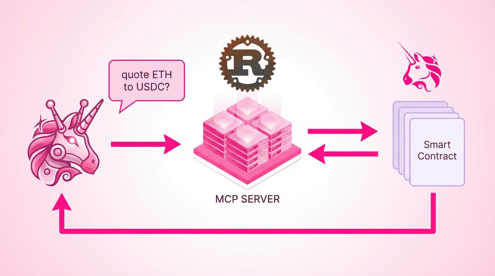

# 🦄 Uniswap MCP Server Rust 🦀



Repository to learn how to code in Rust by building a very basic MCP server that interacts with the Uniswap Trade API. To test, clone the repository and run the following **commands**

```bash
cargo build
cargo run
```


## Learning steps

- [ ] (1) Make a simple server running continuously
- [ ] (2) Make it I can enter different commands while it is running (`start`, `stop`, `unicorns`)
- [ ] (3) Try to use functionalities from the [**allow** web3 library for Rust.](https://github.com/alloy-rs)